# 👋 Hi, I'm Lucas Santos!

### 💻 Systems Analysis and Development | Software & Data

I'm a Brazilian technology enthusiast and a recent graduate in **Systems Analysis and Development (ADS)**.

I'm currently building my career in technology, focusing on developing practical skills through projects, problem solving and continuous learning.

I enjoy turning what I learn into projects that I can actually build, test and improve.

---

## 🚀 About Me

- 🎓 Graduated in **Systems Analysis and Development (ADS)**
- 🇧🇷 From Brazil
- 💻 Currently developing my skills in **Python, SQL, JavaScript, HTML and CSS**
- 📊 Interested in **Data, Systems Development and Automation**
- 🧠 Always learning and improving through practical projects
- 🔭 Building my GitHub portfolio step by step

I'm especially interested in opportunities where I can learn from experienced professionals, contribute to real projects and continue developing my technical skills.

---

## 🛠️ Technologies & Tools

### Programming & Development

  
  
  
  

### Data & Databases

  

### Tools

  
  
  

---

## 📚 Currently Learning

I'm currently focusing on strengthening my fundamentals and turning them into practical projects.

- 🐍 Python
- 🗄️ SQL & Databases
- 🔀 Git & GitHub
- 🌐 Web Development
- 🧩 Algorithms and Problem Solving

---

## 📂 Featured Projects

### 🌐 Personal Portfolio

My personal portfolio website, created to showcase my projects, skills and experience.

**Technologies:** HTML5, CSS3, JavaScript, Git, GitHub Pages

[🌎 Visit the website](https://lucossantos.github.io/Portfolio/) · [📁 View repository](https://github.com/lucossantos/Portfolio)

### 🕒 Timeline

A responsive web application for creating interactive timelines.

Features include event management, proportional date positioning, color filters, JSON import/export, local browser storage, printing/PDF and timeline zoom.

**Technologies:** HTML, CSS, JavaScript

[📁 View repository](https://github.com/lucossantos/linha-do-tempo)

### 🔐 Random Password Generator

A Python project that generates random passwords using uppercase and lowercase letters, numbers and special characters. The password length can be customized directly in the code.

**Technologies:** Python

[📁 View repository](https://github.com/lucossantos/RandomPasswordGenerator)

---

## 📊 GitHub Statistics

  
  

---

## 📫 Let's Connect

I'm always interested in connecting with other people in technology, learning from the community and discovering new opportunities.

---

⭐ Thanks for visiting my profile!

